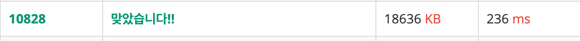
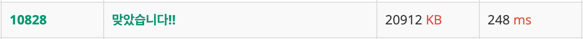
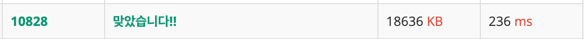

# [PS] 스택

#### Source
백준 10828

https://www.acmicpc.net/problem/10828
#### Category
스택

## 📍 문제 요약
1. 스택 구현
2. 5가지 메소드: push, pop, size, empty, top

## 📍 풀이 접근
1. 자바의 Stack 자료구조를 사용
2. 문제에서 요구하는 추가 정의사항에 맞게, 코드 수정

## 📍 풀이 개선


## 📍 기타 공부

#### IOException
Java에는 checked exception라고 하여, 컴파일러가 예외 처리를 강제하는 예외가 존재 <br>
해당 예외 처리를 하지 않으면, 컴파일시 에러가 발생 (!= 런타임 에러)<br>
IOException은 java.io 패키지와 관련된 작업들이 필요한 경우, 예외 처리가 요구

#### StringTokenizer
문자열을 지정된 구분자를 통해, 토큰화 할 때 사용.<br>
기본적으로 공백을 기준으로 토큰화 하며, 구분자를 지정하기 위해서는 new StringTokenizer()에서
2번째 파라미터로 구분자를 넘겨주면 됨.
```
StringTokenizer st = new StringTokenizer(br.readLine());
StringTokenizer st = new StringTokenizer(br.readLine(),",");
```
위와 같이 인스턴스를 선언할 때, 1번째 파라미터는 토큰화할 문자열, 2번째 파라미터는 구분자(option)
3번째 파라미터(option)는 구분자도 토큰으로 반환할지 여부이다(True, False)<br>

즉, 아래와 같이 StringTokenizer 클래스에는 여러 생성자가 있다.<br>

- StringTokenizer(String str): 문자열을 기본 구분자(공백)로 분할<br>
- StringTokenizer(String str, String delim): 지정된 구분자로 문자열을 분할<br>
- StringTokenizer(String str, String delim, boolean returnDelims): <br>
지정된 구분자로 문자열을 분할하며, returnDelims가 true이면 구분자도 토큰으로 반환


#### Split()
문자열을 가공할 때, split() 또한 사용 가능<br>
StringTokenizer가 레거시 코드로서, 더이상 사용을 권장하지 않다고 함..(from 공식문서)<br>
이번 문제를 split()과 StringTokenizer를 사용 했을때, 아래와 같이 메모리 차이만 좀 컸다.<br>

StringTokenizer<br>


Split<br>


아직 코테 경험이 많지 않아서, 더 공부해 봐야겠지만<br>
아래 글을 읽으면서, PS에서는 Split() 보다는 StringTokenizer를 사용하는 편이 낫겠다고 우선 판단

https://velog.io/@effirin/Java-StringTokenizer%EC%99%80-Split-%EB%A9%94%EC%84%9C%EB%93%9C-%EC%96%B8%EC%A0%9C-%EC%8D%A8%EC%95%BC%ED%95%A0%EA%B9%8C


## 📍 기타 
- 출력 형태가 정수 하나이므로, System.out.println()를 사용하는게 나을지 테스트
- BufferedWriter()가 훨씬 빨랐음<br>

BufferedWriter()

System.out.println()


