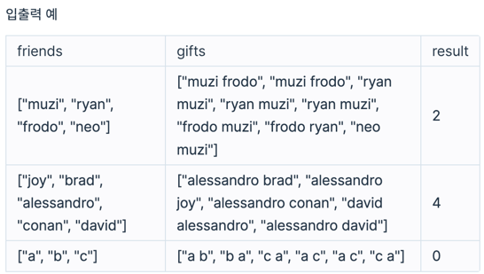

# [PS] 가장 많이 받은 선물

#### Source
프로그래머스
https://school.programmers.co.kr/learn/courses/30/lessons/258712

#### Category
2차원 배열, 해시

## 📍 문제 요약
1. 여러명에 대하여, 두 사람끼리 서로 주고 받은 선물 내역이 주어진다
2. 서로 주고 받은 선물 개수 또는 선물 지수에 따라, 두 사람중 한 사람이 다음달에 선물을 받게 된다.
3. 주어진 사람들 중, 다음달에 선물을 가장 많이 받게 될 사람의 예상 선물 개수 구하기

## 📍 풀이 접근
1. 각 사람의 선물 지수 계산
2. 서로 주고 받은 선물 내역을 2차원 테이블에 저장
3. 2차원 테이블을 순회하며, 두 사람 기준 다음달에 선물 받을 사람 계산
4. 각 사람의 다음달 예상 선물 개수 중 최댓값 반환

## 📍 풀이 개선
**1. 데이터 저장을 위한 불필요한 객체 줄이기**
- 예상 선물 개수 저장용 해시 테이블 삭제  
   → max값만 반환하면 되므로, 예상 선물 개수 계산과 동시에 max값을 업데이트하는 방식으로 변경  
- 2차원 테이블 맵핑을 위해 할당한 개인별 row번호 역맵핑 해시 테이블 삭제  
   → 예상 선물 개수를 해시 테이블로 저장할 때 사용했었음  

**2. for문 사용은 최소화**
- 배열로 해결되는 경우, 굳이 해시 테이블 사용 x 
    → 선물 지수의 경우, 배열로 선언한 뒤 각 인덱스와 indexTable에 저장된 번호와 맵핑하여 사용 가능 
    → 해시 테이블로 선물 지수를 저장할 경우, 처음에 0으로 모두 초기화 하는 과정에서 for문 필요
         (아니면, 처음 값을 넣을 때 0인지 확인하는 조건문이 필요)  

